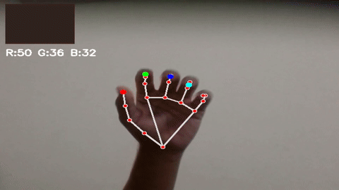

# Hand Tracking Color Mixer

With this project, your hand becomes a live color mixer. Using your webcam, the app tracks your fingers via MediaPipe’s 21-point hand landmark detection. As you move or spread your fingers, it monitors three key distances—thumb to index, index to middle, and middle to ring. Each of these distances adjusts one of the RGB color channels, letting you control color just by moving your hand. The displayed color updates instantly and transitions remain smooth without flickering.

Here’s how it works:
- Real-time video frames are captured using OpenCV.
- MediaPipe identifies your hand and locates all landmarks.
- The distances between fingertips are mapped directly to RGB values.
- You see both a live overlay and a color swatch on the video feed.
- Simple smoothing techniques keep the color steady as your hand moves.

This is a straightforward and interactive demonstration of computer vision and real-time feedback.